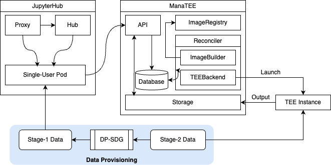
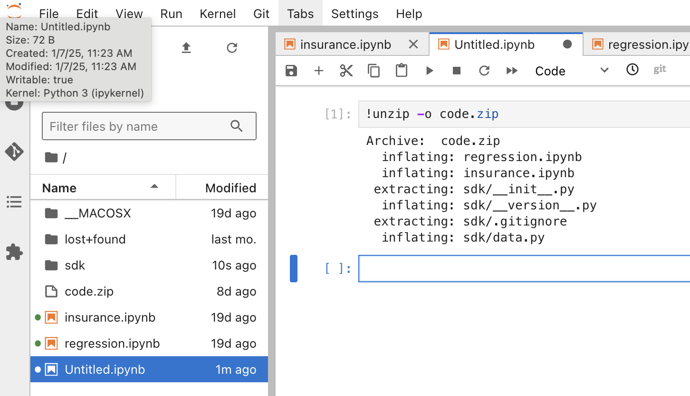
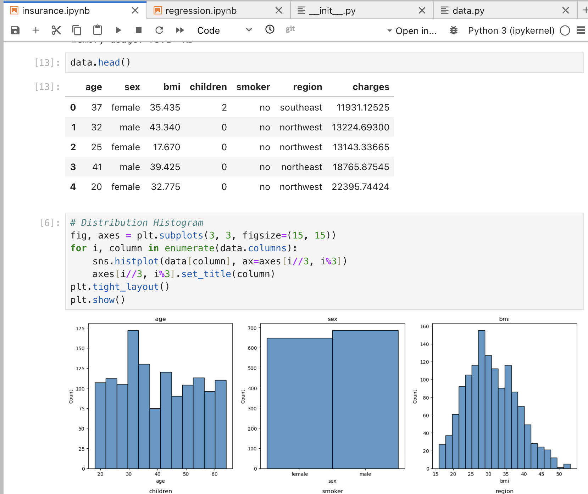
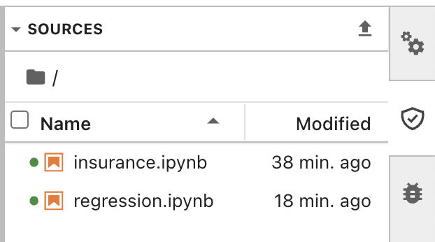
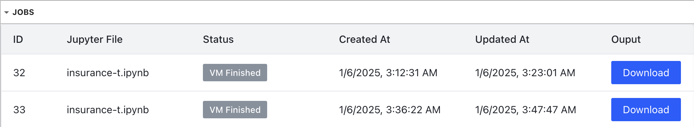

# Tutorials

In this tutorial, we show the following scenario:

* Dataset: [US Health Insurance Dataset from Kaggle](https://www.kaggle.com/datasets/teertha/ushealthinsurancedataset/data)
* Task: Train a model predicting the insurance charge based on the data (use XGBoost regression)
* Data Provisioning: [MST](https://github.com/ryan112358/private-pgm/blob/9fc3a829f344a2ed0b662f4f8d92d5efe18e42ab/mechanisms/mst.py) (2018 NIST snythetic data challenge winner).

<iframe width="854" height="480" src="https://www.youtube.com/embed/Ig1NzZZ6yKE?si=-IjD6v2nqsrAuuuV" title="YouTube video player" frameborder="0" allow="accelerometer; autoplay; clipboard-write; encrypted-media; gyroscope; picture-in-picture; web-share" referrerpolicy="strict-origin-when-cross-origin" allowfullscreen></iframe>

The tutorial uses Google Confidential Space as the TEE backend, and uses preprocessed datasets.

## Overal Workflow

This tutorial uses a very simple prototype data SDK to interact with two different versions of datasets as shown below.


/// Caption
Overall ManaTEE Architecture and Demo Workflow
///


```
.
├── insurance.ipynb
├── regression.ipynb
├── data
│   ├── insurance.csv.s1
│   └── insurance.csv.s2
└── sdk
    ├── __init__.py
    ├── __version__.py
    └── data.py
```

## Data Provisioning

As mentioned earlier, data provisioning currently needs to be done manually by the data owner.
In summary, the data owner needs to:
(1) Use proper techniques to generate stage-1 dataset from the original (stage-2) dataset;
(2) Upload two different data versions to the cloud;
and (3) Use proper access control mechanism to both of the data versions.

We've already preprocessed stage-1 data using [NIST-MST](https://github.com/ryan112358/private-pgm/blob/9fc3a829f344a2ed0b662f4f8d92d5efe18e42ab/mechanisms/mst.py) differentially-private synthetic data generation. Thus, the tutorial starts from (2).

To provision data, first, prepare google cloud storage (GCS) buckets.

```
cd tutorials
```

> You can also run `tutorial.sh` instead of following the instructions below. Make sure to modify the top of the script to replace variables.

Create two buckets (replace `<your-stage-N-bucket>` with unique strings you'd like)

```
export STAGE_1_BUCKET=<your-stage-1-bucket>
export STAGE_2_BUCKET=<your-stage-2-bucket>
```

```
gcloud storage buckets create gs://$STAGE_1_BUCKET
gcloud storage buckets create gs://$STAGE_2_BUCKET
```

Then, upload datasets into the bucket:

```
gcloud storage cp data/stage1/insurance.csv gs://$STAGE_1_BUCKET
gcloud storage cp data/stage2/insurance.csv gs://$STAGE_2_BUCKET
```


<!-- In general, the data access control should be implemented based on remote attestation protocol provided by the TEE instance.
Google Confidential Space [recommends](https://cloud.google.com/docs/security/confidential-space) to use Google KMS and an OpenID Connect (OIDC) token provider.

 -->

## Data Permissions

Now, let's use a proper access control mechanism to both of the datasets.
In the demo, attestation is used only for checking the integrity of the workload and its output.
Thus, we omit encryption and attestation policy check based on image hash in this tutorial.
However, it does not mean that ManaTEE limits how the data provider should leverage the attestation policy.

### Stage-1 Permission

Give the JupyterLab single-user instance a permission to access stage-1 data. Replace `<your-project-id>` with your GCP project ID.

```
export PROJECT_ID=<your-project-id>
```

```
gcloud storage buckets add-iam-policy-binding gs://$STAGE_1_BUCKET \
  --member=serviceAccount:jupyter-k8s-pod-sa@$PROJECT_ID.iam.gserviceaccount.com \
  --role=roles/storage.objectViewer \
```

### Stage-2 Permission

Now, let's give the TEE instance a permission to access stage-2 data.

First, create a service account that will be used by the TEE instance. Replace `<your-service-account-name>` with a unique string you want to use for the service account.

```
export TEE_SERVICE_ACCOUNT=<your-service-account-name>
```

```
gcloud iam service-accounts create $TEE_SERVICE_ACCOUNT
```

Give the service account access to the bucket.

```
gcloud storage buckets add-iam-policy-binding gs://$STAGE_2_BUCKET \
  --member=serviceAccount:$TEE_SERVICE_ACCOUNT@$PROJECT_ID.iam.gserviceaccount.com \
  --role=roles/storage.objectViewer
```

Now, we are going to use Google Confidential Space's token to make TEE impersonate the service account.

First, create a workload identity pool. Replace `<your-pool-name>` with a unique string you want to use as a workload identity pool name.

```
export WORKLOAD_IDENTITY_POOL_NAME=<your-pool-name>
```

```
gcloud iam workload-identity-pools create $WORKLOAD_IDENTITY_POOL_NAME \
  --location=global
```

Then, grant the service account permission to impersonate the workload identity pool.
```
gcloud iam service-accounts add-iam-policy-binding \
    $TEE_SERVICE_ACCOUNT@$PROJECT_ID.iam.gserviceaccount.com \
    --member="principalSet://iam.googleapis.com/projects/"$(gcloud projects describe $PROJECT_ID \
        --format="value(projectNumber)")"/locations/global/workloadIdentityPools/$WORKLOAD_IDENTITY_POOL_NAME/*" \
    --role=roles/iam.workloadIdentityUser
```

Finally, create a workload identity pool provider.

```
gcloud iam workload-identity-pools providers create-oidc attestation-verifier \
    --location=global \
    --workload-identity-pool=$WORKLOAD_IDENTITY_POOL_NAME \
    --issuer-uri="https://confidentialcomputing.googleapis.com/" \
    --allowed-audiences="https://sts.googleapis.com" \
    --attribute-mapping="google.subject=\"gcpcs::\"+assertion.submods.container.image_digest+\"::\"+assertion.submods.gce.project_number+\"::\"+assertion.submods.gce.instance_id" \
    --attribute-condition="assertion.swname == 'CONFIDENTIAL_SPACE' && 'STABLE' in assertion.submods.confidential_space.support_attributes"
```

## Job Submission

### Prepare Jupyter Environment

Now, a JupyterHub user can use the notebook interface to write a script and submit it to the API via a JupyterLab extension called `jupyerlab-manatee`.
The extension is already installed in the deployed Jupyter Hub single-user image.

Please go to `tutorials` directory, and upload the `code` directory into the JupyterLab environment.

```
cd code
zip -r ../code.zip .
cd ..
```

Upload the `code.zip` to the JupyterLab interface.

Then, unzip it by running the following cell in the notebook

```
!unzip -o code.zip
```



### Stage-1: Programming

Open `insurance.ipynb`. Replace the following line with a proper variables and bucket names that you used when provisioning the data.

```
sdk.gcp.init("<your gcp project ID>", "<your workload identity pool name>","<your TEE service account name>")
repo = sdk.DataRepo("gs://<your stage-1 bucket>", "gs://<your stage-2 bucket>")
raw = repo.get_data("insurance.csv")
data = pandas.read_csv(io.StringIO(raw))
```

When you run the cells, you will be able to see the stage-1 data getting fetched and processed. You can change the code to furthre explore the dataset.



### Stage-2: Secure Execution

When ready, the user can use the ManaTEE extension to submit a job to the ManaTEE API. The API address is determined at the deployment, and passed through as an environment variable.
You can access the extension by pressing the shield button on the side (<svg xmlns="http://www.w3.org/2000/svg" fill="none" width="16" viewBox="0 0 24 25" data-icon="ui-components:trusted" data-icon-id="8019c324-7523-489c-b135-519ff171b0fd"><path class="jp-icon2" stroke="#333333" stroke-width="2" transform="translate(2 3)" d="M1.86094 11.4409C0.826448 8.77027 0.863779 6.05764 1.24907 4.19932C2.48206 3.93347 4.08068 3.40347 5.60102 2.8449C7.23549 2.2444 8.85666 1.5815 9.9876 1.09539C11.0597 1.58341 12.6094 2.2444 14.218 2.84339C15.7503 3.41394 17.3995 3.95258 18.7539 4.21385C19.1364 6.07177 19.1709 8.77722 18.139 11.4409C17.0303 14.3032 14.6668 17.1844 9.99999 18.9354C5.3332 17.1844 2.96968 14.3032 1.86094 11.4409Z"></path><path class="jp-icon2" fill="#333333" stroke="#333333" transform="translate(8 9.86719)" d="M2.86015 4.86535L0.726549 2.99959L0 3.63045L2.86015 6.13157L8 0.630872L7.27857 0L2.86015 4.86535Z"></path></svg>).



Select the file and press upload button (<svg xmlns="http://www.w3.org/2000/svg" width="16" viewBox="0 0 24 24" data-icon="ui-components:file-upload" class=""><g xmlns="http://www.w3.org/2000/svg" class="jp-icon3" fill="#616161"><path d="M9 16h6v-6h4l-7-7-7 7h4zm-4 2h14v2H5z"></path></g></svg>).

This will create an entry in the "Jobs" tab, which will take some time to build and run.

Once the job is completed, you can download the output by pressing "Output" button, or see the attestation token by pressing "Access Report" button.



Try to run both of "insurance.ipynb" and "regression.ipynb", both in the programming stage, and by submitting to the secure execution stage.
