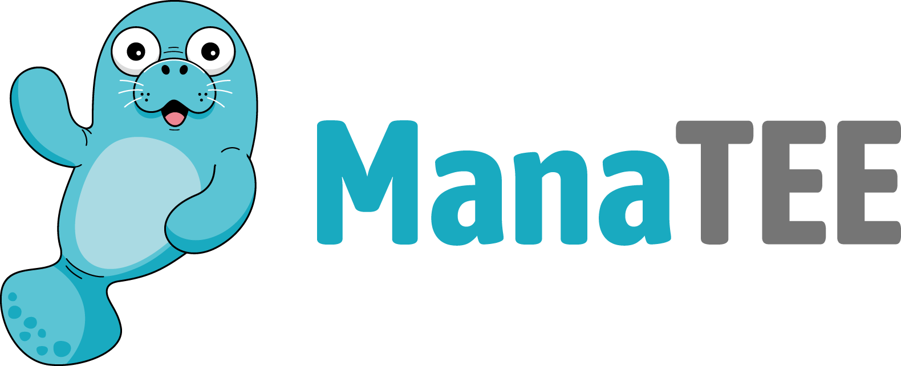
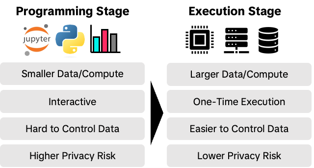

# Welcome to ManaTEE Project

ManaTEE is an open-source framework for secure data analytics in public research. It leverages Privacy Enhancing Technologies, including confidential computing, to protect sensitive data while maintaining usability.

ManaTEE Project was initiated in 2024 as a core use case of TikTok. Now part of the Confidential Computing Consortium, ManaTEE addresses the growing challenges of balancing privacy, usability, and accuracy in enterprise data collaboration.

## Two-Stage Data Analytics Platform

ManaTEE introduces a two-stage data clean room model to provide an interactive interface for exploring data while protecting private data during processing. It combines different privacy-enhancing technologies (PETs) across two stages:

* **Programming Stage**: Data consumers explore datasets using low-risk data, employing different PETs such as pseudonymization or differentially private synthetic data generation.
* **Secure Execution Stage**: Workloads run in a trusted execution environment (TEE), which provides attestable integrity and confidentiality guarantees for the workload in the cloud.

/// Caption
Two-stage data clean room model
///

## Key Features

ManaTEE provides following key benefits:

* **Interactive Programming**: Integrated with Jupyter Notebook, allowing data consumers to work with Python and other popular languages.
* **Cloud-Ready**: ManaTEE can be easily deployed to existing cloud TEE backends such as Google Cloud. We plan to support other backends as well, eliminating the need to build the entire infrastructure from scratch.
* **Flexible PET**: Data providers can control the protection mechanisms at each stage to tailor to specific privacy requirements of the data.
* **Trusted Execution Environment**: By leveraging TEEs, ManaTEE ensures a high level of confidence in data confidentiality and program integrity for both data providers and data consumers.
* **Accuracy and Utility**: ManaTEE employs a two-stage design to ensure that result accuracy is not compromised for the sake of privacy.

## Use Cases

Potential use cases for ManaTEE include:

* **Trusted Research Environments (TREs)**: Secure data analysis for public health, economics, and more, while maintaining data privacy.
* **Advertising & Marketing**: Lookalike segment analysis and private ad tracking without compromising user data.
* **Machine Learning**: Enables private model training without exposing sensitive data or algorithms.
